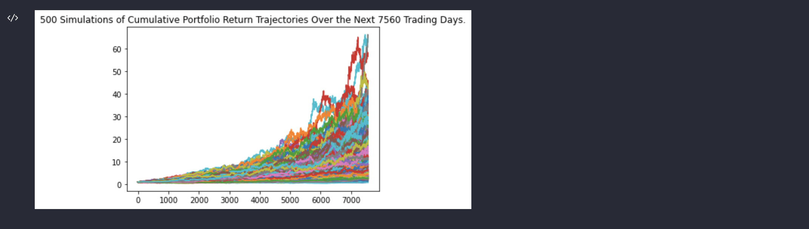

# *Financial Planning*
---

**Welcome to my repository for the project on financial planning. Please explore the codebase!** <br />

>“Always borrow money from a pessimist. He won’t expect it back.” – Oscar Wilde
---
## Analytical Summary

With minor changes, you can use this project to evaluate your financial health. First, you will be able to see savings and determine if you have enough reserves for an emergency fund. Second, you will be able to forecast a reasonably effective retirement plan based on your current holdings of cryptocurrencies, stocks, and bonds. 

---

## Technologies

This project leverages python 3.7 with the following packages:
* [os](https://github.com/python/cpython/blob/3.10/Lib/os.py) - Library for using operating system dependent functionality. This library is built in - no need to install it.

* [requests](https://pypi.org/project/requests/) - Library for sending HTTP requests easily.

* [json](https://github.com/python/cpython/blob/3.10/Lib/json/__init__.py) - Library for parsing JSON format. This library is built in - no need to install it.

* [pandas](https://pandas.pydata.org) - Library for fast manipulation with DataFrames, reading and writing csv files.

* [dotenv](https://pypi.org/project/python-dotenv/) - Sets key-value pairs as environment variables.

* [alpaca_trade_api](https://pypi.org/project/alpaca-trade-api/) - Library for Alpaca Commission Free Trading API.

* [matplotlib](https://matplotlib.org) - Library for visualizations in Python.

* [numpy](https://numpy.org) - Library for working with arrays.

* [datetime](https://github.com/python/cpython/blob/3.10/Lib/datetime.py) -  Library for manipulating dates and times.

* [pytz](https://pypi.org/project/pytz/) - Library for timezone calculations.
* [warnings](https://github.com/python/cpython/blob/3.10/Lib/warnings.py) - Library for manipulating warning messages. This library is built in - no need to install it.
---

## Installation Guide

Before running the application first install the following dependencies.

```python
  pip install requests
  pip install pandas
  pip install python-dotenv
  pip install alpaca_trade_api
  pip install matplotlib
  pip install numpy
  pip install datetime
  pip install pytz
```
---

## Usage

To use this project simply clone the repository and run the code **financial_planning_tools.ipynb** in JupyterLab or in VS Code.

---
## Graphs

First, we evaluate the crypto-currency wallet and stock, and bond holdings. The portfolio valuation helps us decide if we have enough savings to build an emergency fund. Data are collected by scraping Free Crypto API and using Alpaca SDK.


The pie chart displays total value of the portfolio.


Second, we forecast future appreciation of the portfolio with Monte Carlo simulations.




Finally, we plot the cumulative returns across all the simulations and evaluate an option for early retirement.


---

## Contributors

Brought to you by Katerina Gawthorpe.

---

## License

MIT